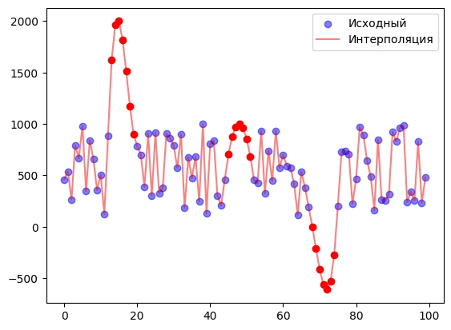

# Минимальные технические требования

* ОС Winodws (Не ниже 8), Linux, MacOS
* Python >= 3.8

# Рекомендованная версия Python

Разработка библиотеки и тестирование проводилось на версии Python `3.12.2`. 

# Установка

Чтобы использовать локально, предварительно необходимо склонировать к себе `master` ветку репозитория.

```bash
git clone -b master https://github.com/tms-lib/tms
```

После этого необходимо перейти в папку с библиотекой:

```bash
cd tms
```

А далее, если используете Python 3.12.2:

```bash
pip install -r requirements.txt
```

Если возникли ошибки при установке библиотеки или используете другую версию Python:

```bash
pip install -r requirements-noversion.txt
```

# Тестирование

```bash
pytest
```

# Документация

[Документация к бибилотеке](docs.md)

# Добавление нового функционала

Чтобы добавить новый функционал в библиотеку (или исправить существующий), необходимо: 

* сделать форк этого репозитория (ветка `master`)
* сделать отдельную ветку в своем локальном репозитории
* внести изменения / добавить новый функционал 
* сделать пулл-реквест в основной репозиторий с подробным описанием нового функционала

В течение нескольких дней разработчики библиотеки проверят ваш пулл-реквест и смержат его в основную библиотеку / отправят на доработку. 

**Важно:** Обратите внимание - любой новый функционал должен быть покрыть автотестами. 

# Лицензия

Библиотека `tms` использует лицензию Apache 2.0.

# Примеры использования

Напишем код, который считывает данные по API, а затем проводит интерполяцию сплайнами по пропущенным данным.

**Примечание:** Перед запуском необходимо установить `matplotlib`.

```python
import tms
import matplotlib.pyplot as plt

# считывание временного ряда по API
ts = tms.TimeSeries("http://www.randomnumberapi.com/api/v1.0/random?min=100&max=1000&count=100")

# выкалываем некоторые узлы для дальнейшей интерполяции
missing = [[45, 52], [13, 20], [68, 75]]

for arr in missing:
    ts[arr[0]:arr[1]] = [None] * (arr[1] - arr[0])
 
# строим график исходного временного ряда    
plt.scatter(range(len(ts)), ts, label='Исходный', alpha=0.5, color='blue');

# выполняем интерполяцию сплайнами
interpolated = tms.interpolation.interpolate(ts, 'spline', 10, 10)
plt.plot(interpolated, label='Интерполяция', color='red', alpha=0.5);

# строим график интерполированных участков
for arr in missing:
    plt.scatter(range(arr[0], arr[1]), interpolated[arr[0]:arr[1]], color='red');
   
# выводим легенду графика    
plt.legend();
```

Посмотрим на результат:



А теперь рассчитаем описательные статистики интерполированного ряда:

```python
print(f"\n Колмогоровское среднее 3 порядка: {tms.stats.kolmogorov_mean(interpolated, 3)}\n")
print(f"\n Среднее значение: {tms.stats.mean(interpolated)}\n")
print(f"\n Автокорреляция с лагом 2: {tms.stats.autocorrelation(interpolated, 2)}\n")
print(f"\n 50% перцентиль: {tms.stats.percentile(interpolated, 50)}\n")
print(f"\n Медиана: {tms.stats.median(interpolated)}\n")
```

Результат:

```txt
 Колмогоровское среднее 3 порядка: 569.9560442995079

 Среднее значение: 588.5715385336848

 Автокорреляция с лагом 2: 0.5874306887703938

 Автокорреляция с лагом 2: 582.5

 Автокорреляция с лагом 2: 582.5
```

# Перечень направлений прикладного использования разработанной библиотеки

1) Финансовый анализ и прогнозирование

* Анализ фондовых рынков: прогнозирование цен акций, вычисление и анализ волатильности, исследование автокорреляций в ценах акций.
* Анализ криптовалют: прогнозирование курсов криптовалют, анализ трендов и волатильности.
* Управление рисками: оценка и управление финансовыми рисками с использованием статистических тестов и прогнозных моделей.
* Определение стратегии торговли: создание и тестирование алгоритмических торговых стратегий на исторических данных.

2) Экономика и макроэкономика

* Анализ временных рядов макроэкономических показателей: исследование и прогнозирование ВВП, инфляции, уровня безработицы и других показателей.
* Исследование потребительского поведения: анализ и прогнозирование временных рядов потребительских расходов.
* Оценка экономических циклов: анализ бизнес-циклов, выявление фаз роста и спада.

3) Промышленность и производство

* Мониторинг производственных процессов: анализ и прогнозирование показателей производительности, контроль качества продукции.
* Управление цепочками поставок: прогнозирование спроса на продукцию, оптимизация запасов.
* Техническое обслуживание: прогнозирование поломок оборудования и планирование технического обслуживания на основе временных рядов.

4) Метеорология и климатология

* Прогнозирование погоды: моделирование и прогнозирование погодных условий, исследование климатических изменений.
* Анализ климатических данных: исследование долгосрочных климатических трендов, анализ изменений температуры, осадков и других параметров.


5) Здравоохранение

* Эпидемиология: прогнозирование распространения инфекционных заболеваний, анализ временных рядов заболеваемости.
* Биомедицинские исследования: анализ временных рядов биологических сигналов, таких как ЭКГ, ЭЭГ и другие.
* Управление ресурсами здравоохранения: прогнозирование спроса на медицинские услуги, анализ загруженности больниц.

6) Энергетика

* Прогнозирование потребления энергии: моделирование и прогнозирование спроса на электроэнергию, газ и другие ресурсы.
* Анализ данных о возобновляемых источниках энергии: исследование временных рядов генерации энергии от солнца, ветра и других возобновляемых источников.
* Управление сетями энергоснабжения: прогнозирование нагрузок на электрические сети, оптимизация распределения энергии.

7) Транспорт и логистика

* Прогнозирование транспортных потоков: моделирование и прогнозирование транспортных потоков, управление загруженностью дорог.
* Оптимизация маршрутов: анализ временных рядов для оптимизации маршрутов доставки.
* Анализ данных о движении: исследование временных рядов данных о движении транспортных средств для улучшения безопасности и эффективности.

8) Маркетинг и потребительская аналитика

* Прогнозирование продаж: анализ временных рядов продаж для прогнозирования будущих объемов.
* Анализ эффективности маркетинговых кампаний: оценка влияния маркетинговых кампаний на продажи, анализ временных рядов откликов клиентов.
* Поведенческая аналитика: исследование временных рядов данных о поведении клиентов для улучшения клиентского опыта.

9) Научные исследования

* Исследование временных рядов в физике и астрономии: анализ временных рядов астрономических наблюдений, моделирование физических процессов.
* Экологические исследования: анализ временных рядов данных о состоянии окружающей среды, исследование трендов и аномалий.

10) Образование и исследования

* Анализ образовательных данных: прогнозирование успеваемости студентов, исследование временных рядов данных об образовательных процессах.
* Социальные исследования: анализ временных рядов данных о социальных явлениях, прогнозирование трендов в обществе.

11) Бизнес-аналитика

* Анализ KPI: мониторинг и прогнозирование ключевых показателей эффективности бизнеса.
* Оптимизация бизнес-процессов: анализ временных рядов для оптимизации производственных и операционных процессов.
